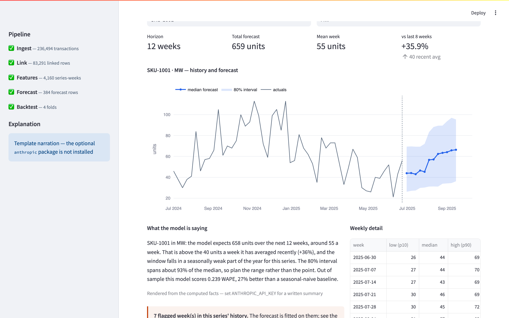
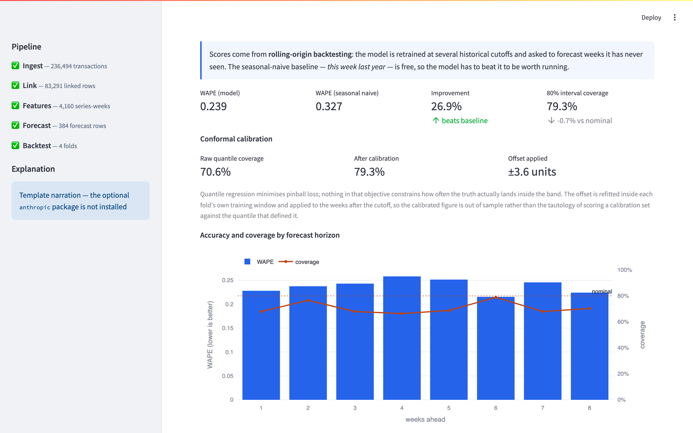
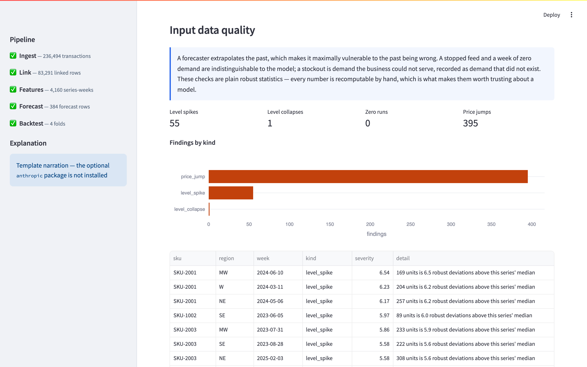
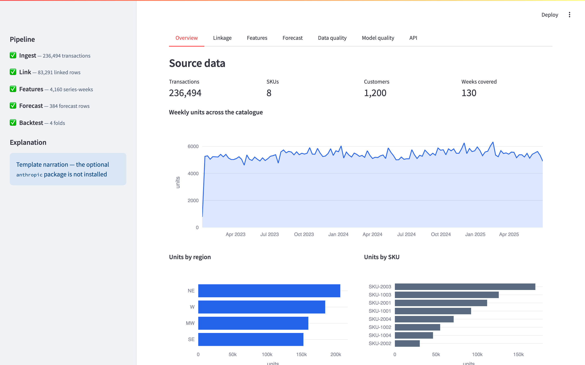
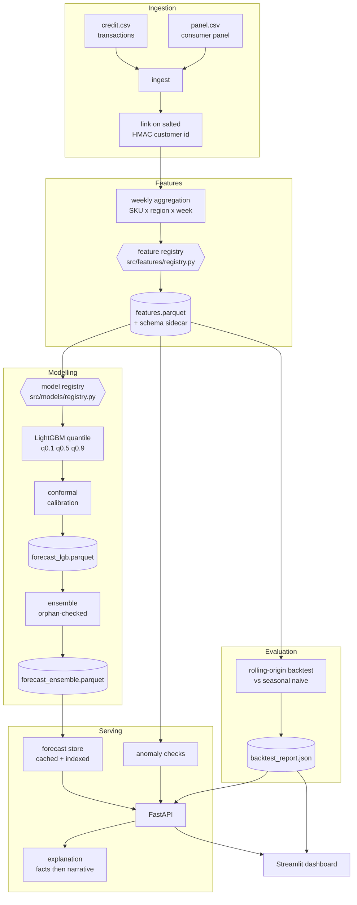
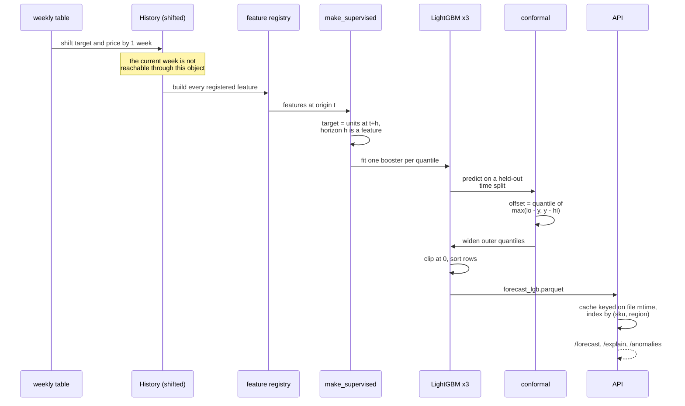

# SKU × Region Demand Forecasting

Weekly unit-demand forecasts for every SKU in every region, with a **calibrated
prediction interval rather than a single number**, served over an API and
scored against a baseline it has to beat.

LightGBM quantile regression with conformal interval calibration, a FastAPI
service, and a Streamlit dashboard. Runs from a clean clone with one command
and no credentials.

The numbers that matter, measured over four rolling-origin folds on weeks the
model never saw:

```
              WAPE     naive     lift    raw cover   calibrated
mean         0.239     0.327    26.9%       70.6%        79.3%
```

27% better than "the same week last year", and an 80% prediction interval that
actually covers 79.3% — because conformal calibration was added and measured,
not because the raw quantiles were already honest. They were not: they covered
70.6%.

---

## Screenshots



The forecast tab: history, the calibrated 80% band, a plain-language note
generated from computed facts, and a flag when the series' own inputs are
suspect.



Rolling-origin backtest results, including what conformal calibration did to
coverage. Every figure here is read from `backtest_report.json`, which is
written by an actual scoring run.



Anomaly flags on the data the model was fitted on — stockouts, stopped feeds,
price errors. A forecaster extrapolates the past, so the past being wrong is
its most expensive failure mode.



---

## Architecture

The pattern is a **layered pipeline with two registries as its extension
points**. Data flows one way — ingest → link → features → model → ensemble →
serve — and dependencies point inward: the serving layer knows nothing about
parquet layout, the store knows nothing about HTTP, and the dashboard's data
layer knows nothing about Streamlit (there is a test that fails if it learns).



Everything under `DATA_DIR` is derived and git-ignored. The two CSVs in
`examples/sample_data/` are committed *input schema examples* and are never
written to — see "The two data traps" below for why that separation earns its
keep.

## How a forecast is produced



---

## Quickstart

```bash
make up          # build, seed the data volume, start API + dashboard
```

- Dashboard: **http://localhost:8361**
- API docs: **http://localhost:8360/docs**

`make up` runs a one-shot `seed` service that executes the whole pipeline into
a named volume before the API starts, so the dashboard is populated on first
load rather than showing an empty state.

```bash
curl -X POST http://localhost:8360/forecast \
  -H 'Content-Type: application/json' \
  -d '{"sku":"SKU-1001","region":"NE","horizon_weeks":4}'
```

```json
[
  {"sku": "SKU-1001", "region": "NE", "date": "2025-06-30",
   "q0.1": 46.37, "q0.5": 62.39, "q0.9": 116.06},
  {"sku": "SKU-1001", "region": "NE", "date": "2025-07-07",
   "q0.1": 47.16, "q0.5": 62.70, "q0.9": 116.79}
]
```

Other endpoints:

```bash
curl -s "http://localhost:8360/anomalies?sku=SKU-2001&limit=2"
curl -s -X POST http://localhost:8360/explain \
  -H 'Content-Type: application/json' \
  -d '{"sku":"SKU-1001","region":"NE","horizon_weeks":12}'
curl -s http://localhost:8360/models
```

`/explain` with no `ANTHROPIC_API_KEY` set — the default — returns:

```json
{
  "sku": "SKU-1001", "region": "NE",
  "source": "template", "model": null,
  "explanation": "SKU-1001 in NE: the model expects 1,013 units over the next 12 weeks, around 84 a week. That is above the 65 units a week it has averaged recently (+30%), and the window falls in a seasonally weak part of the year for this series. The 80% interval spans about 87% of the median, so plan the range rather than the point. Out of sample this model scores 0.239 WAPE, 27% better than a seasonal-naive baseline. Note that 14 week(s) of input for this series are flagged as suspect, so the forecast inherits whatever caused them."
}
```

Tear down with `make down` (removes the data volume too).

---

## Configuration

| Variable | Required | Default | What it does |
|---|---|---|---|
| `DATA_DIR` | no | `./data` | Where the pipeline reads and writes every artifact. Git-ignored. Compose sets it to `/data`, a named volume shared by all three services. |
| `PROJECT_ROOT` | no | repo root | Overrides the path `DATA_DIR` and `artifacts/` are resolved against. Used by tests. |
| `HASH_SALT` | **for anything real** | `CHANGE_ME_SECRET_SALT` | HMAC-SHA256 salt for customer-id hashing. The default is public, so it protects nothing; two runs under different salts produce non-comparable hashes. |
| `API_URL` | no | `http://localhost:8000` | Where the dashboard looks for the API. Compose sets `http://api:8000`, because inside the dashboard container `localhost` is the dashboard. |
| `ANTHROPIC_API_KEY` | no | unset | Enables written forecast narration on `/explain` and in the dashboard. Unset, the same facts render from a template and everything still returns 200. |
| `MLFLOW_TRACKING_URI` | no | empty | Set to enable MLflow tracking. `mlflow` is an optional install. |

No variable is required to run the system end to end.

---

## Development

Python 3.11 is what the image uses and what the pins are chosen for.

```bash
python3.11 -m venv .venv && source .venv/bin/activate
pip install -r requirements-core.txt -r requirements-dev.txt

# LightGBM needs an OpenMP runtime its wheel does not bundle.
# Linux: the image installs libgomp1. macOS:
brew install libomp
```

Without `libomp`, `import lightgbm` fails with a `dlopen` error about
`libomp.dylib` that looks nothing like a missing system package. This was
verified on macOS 26 / Apple silicon during the 2026-09-23 pass: `brew install
libomp` is the whole fix, and the suite goes from two collection errors to
green.

```bash
python -m scripts.run_pipeline --weeks 130 --horizon 12   # data → forecasts
python -m src.evaluation.backtest --folds 4 --horizon 8   # measured accuracy
python -m pytest tests/ -q                                # 289 tests, ~4s
python -m ruff check . && python -m ruff format --check . # lint + format
python -m scripts.benchmark                               # scalability numbers

uvicorn src.serving.app:app --port 8000                   # API
streamlit run streamlit_demo.py                           # dashboard
```

The pipeline takes about 13 seconds end to end: 236,494 transactions
generated, linked to 83,291 panel-matched rows, aggregated to 4,160 SKU ×
region weeks, reshaped to 47,424 supervised rows, three boosters fitted, and
the conformal offset calibrated.

`make test`, `make lint` and `make benchmark` run the same things in the
container.

---

## Project structure

```
src/
├── config.py                     Paths and quantiles. No import side effects.
├── ingest/                       CSV → parquet, with column validation
├── linking/                      Panel ↔ transactions on salted HMAC hash
├── weighting/raking.py           Iterative proportional fitting to population totals
├── features/
│   ├── registry.py               ★ the feature seam; History makes leaks unwritable
│   └── build_features.py         Weekly aggregation, gap filling, schema sidecar
├── models/
│   ├── registry.py               ★ the model seam; orphan-artifact detection
│   ├── train_lgb_quantile.py     Direct multi-horizon quantile LightGBM
│   ├── train_deepar_gluonts.py   stub — deliberately NOT registered
│   └── train_pymc_hierarchical.py stub — deliberately NOT registered
├── ensemble/                     Combine models; average over who actually predicted
├── evaluation/
│   ├── backtest.py               Rolling origin, seasonal-naive baseline, parallel folds
│   └── conformal.py              Split-conformal interval calibration (CQR)
├── quality/anomalies.py          Robust input checks: spikes, zero runs, price jumps
├── explain/
│   ├── facts.py                  Computed facts, incl. LightGBM SHAP attributions
│   └── narrative.py              Optional Claude narration; template fallback
├── serving/
│   ├── store.py                  Cached, indexed, column-projected forecast reads
│   └── app.py                    FastAPI — thin: validate, call a service, shape
├── dashboard/data.py             Dashboard logic, with no Streamlit import
├── utils/                        WAPE, pinball loss, HMAC hashing, column checks
└── mlops/mlflow_utils.py         Optional MLflow helpers (mlflow is not a core dep)

scripts/
├── generate_sample_data.py       Seeded synthetic demand with real structure
├── run_pipeline.py               The whole thing, in order
├── benchmark.py                  Every performance number in this README
└── preview-readme.sh             Render this README locally the way GitHub does

streamlit_demo.py                 The dashboard (presentation only)
dags/forecast_dag.py              Airflow DAG over the same steps (optional)
tests/                            289 tests, 22 files
examples/sample_data/             Committed *input schema* examples. Never written to.
```

---

## Design notes

### The leak, and why it is now structural

`build_features` once computed a trailing average on the raw target column, so
the window at week `t` included week `t`'s own units. The 2026-09-22 audit
fixed that and pinned it with tests.

The weakness in "fixed and pinned" is that the tests enumerate the columns that
exist *today*. The next person to add a feature writes it by hand against the
DataFrame, reaches for `df["units_sold"].rolling(4)`, and the suite still
passes because it has never heard of their column.

So features are no longer written against the DataFrame at all. They are
declared in `src/features/registry.py` and handed a `History`, whose only data
are the target and price series **already shifted one period**:

```python
@history_feature("roll_4w_mean", "Mean weekly units over the 4 weeks before this one")
def _roll_4w(h: History) -> pd.Series:
    return h.mean(4)
```

`History.lag(0)` raises. There is no accessor that returns the current week.
The leaking line is not discouraged through this interface — it is
unwritable. And because `tests/test_no_leakage.py` and
`tests/test_feature_registry.py` both *enumerate the registry*, a feature added
tomorrow is covered by the change-the-last-week invariance check the moment it
is registered.

**Re-proved, not assumed.** The guarantee was re-verified the same way the
original audit verified it: `History.lag` was edited to shift one week the
wrong way — making `lag(1)` the *next* week — and the suite was run. Six tests
failed across `test_no_leakage.py` and `test_split_boundary.py`, including the
decisive invariance check and the backtest boundary check. The leak was then
reverted and the suite returned to green. The tests detect the thing they claim
to detect.

### Conformal calibration: the interval now means what it says

The backtest reported an 80% interval covering about 71%. That is the more
dangerous of the two headline numbers: a planner sizing safety stock against a
band that is narrower than advertised is being told the tail risk is smaller
than it is. Quantile regression minimises pinball loss, and nothing in that
objective constrains how *often* the truth lands inside the band.

`src/evaluation/conformal.py` implements conformalised quantile regression
(Romano, Patterson & Candès, 2019). On a disjoint calibration slice, score each
row by how far outside the band it fell, take the finite-sample-corrected
empirical quantile of those scores, and widen both ends by it.

Measured, out of sample, refitting the offset **inside each fold's own training
window**:

```
cutoff         rows     WAPE    naive    lift   cover     cal
--------------------------------------------------------------
2024-11-11      256    0.233    0.341  31.9%   68.8%   73.4%
2025-01-06      256    0.244    0.316  22.9%   71.9%   83.2%
2025-03-03      256    0.243    0.330  26.4%   69.9%   78.5%
2025-04-28      256    0.236    0.320  26.1%   71.9%   82.0%
--------------------------------------------------------------
mean                   0.239    0.327  26.9%   70.6%   79.3%

  PASS: beats seasonal-naive by 26.9%
  PASS: 80% interval covers 79.3% after conformal calibration
        (70.6% raw, within ±15pp of nominal)
```

**70.6% → 79.3% against a nominal 80%.** The calibration figure is out of
sample: the offset never sees a week after its fold's cutoff, so this is not
the tautology of scoring a calibration set against the quantile that defined
it. The CI gate now checks the *calibrated* interval, because that is the one
the API serves.

The honest caveat: conformal's coverage guarantee assumes exchangeability,
which does not hold exactly for a time series — the calibration slice is the
recent past and the rows being predicted are the future. That is why the effect
is measured out of sample rather than asserted from the theorem.

### The two data traps, and the seams that close them

Two defects were left deliberately for this pass, and both were real.

**1. The ensemble depended on an orphan artifact.**
`examples/sample_data/features/forecast_deepar.parquet` was committed, was
blended into every local ensemble run, and **was written by no code in this
repository** — the DeepAR trainer has only ever been a stub that raises. So the
served forecast was silently averaged with 36 rows of numbers from a long-dead
eight-transaction toy dataset.

Deleting the file fixes today. `src/models/registry.py` fixes the class: which
models exist is a fact about the code, not about the filesystem. A
`forecast_*.parquet` that no **registered, implemented** forecaster produces is
an orphan — named in the log, surfaced at `GET /models` and in the dashboard
sidebar, and excluded from the blend. If orphans are the *only* forecasts
present, the ensemble refuses to build rather than producing one from artifacts
with no producer. `--include-unregistered` exists for the legitimate case, and
requires someone to ask for it.

**2. The committed feature table carried the leaking column.**
`features.parquet` still had `rolling_4w_mean` — the pre-fix trailing window
that included the week it described — while the trainer selects its inputs by
the `roll_` prefix. Training against it would have fed the model the leaking
column, silently.

Deleting it fixes today. The schema sidecar fixes the class: `build()` writes
`features.parquet.schema.json` naming the schema version and the exact feature
set, and `load_feature_table()` refuses anything that does not match the
registry compiled into the running code, naming the offending columns:

```
features.parquet was built by a different feature registry (schema v1, this
code is v2). Columns it has that the registry no longer defines:
['rolling_4w_mean']. Regenerate it with `python -m src.features.build_features`.
```

**The root cause of both** was that `DATA_DIR` defaulted to
`examples/sample_data/`, so inputs and pipeline output shared a directory and
derived artifacts got committed alongside the examples. `DATA_DIR` now defaults
to a git-ignored `data/`, `examples/sample_data/` holds input schema examples
the pipeline never writes to, and a test asserts the two cannot overlap.

### Scalability — measured, not asserted

Every number below comes from `python -m scripts.benchmark`, run on an Apple M1
Pro (8 cores), Python 3.12, 130 weeks of history, 100 boosting rounds. Re-run
it; the script prints the same table.

**The serving bottleneck was real and was the worst one.** `/forecast` read the
entire forecast parquet, every column and every series, on *every request*, in
order to return at most twelve rows. `src/serving/store.py` now reads once,
caches keyed on the file's `(mtime_ns, size)`, indexes by `(sku, region)`, and
pushes column projection into pyarrow.

| 25,000 series × 12 weeks | per request |
|---|---|
| read parquet per request (before) | 30,453 µs |
| cached + indexed, warm (after) | **26 µs** |
| cached, first request after a pipeline run (cold) | 1,212,999 µs |

Roughly 1,170× on the warm path. The cold start is quoted because it is real:
the first request after a pipeline run pays a 1.2 s index build. The
stat-keyed invalidation means a pipeline run is picked up on the next request
with no restart and no TTL — never stale, never needlessly cold.

**The feature build's bottleneck was not where it looked.** Gap-filling looped
in Python and called `reindex` once per series. The obvious fix — one
`pd.date_range(freq="W-MON")` per span, then explode — turned out to be only
1.2× faster, because `W-MON` is a custom offset that pandas walks one step at a
time in Python; profiling a 2,048-series build put 2.7 of 3.7 seconds inside
`date_range` alone. Weeks are a regular 7-day grid, so numbering them from a
common Monday epoch and building the index with numpy removes the problem
entirely:

| series × 130w | rows | gap-fill (was) | gap-fill (now) | + features | peak MB |
|---|---|---|---|---|---|
| 8 | 1,040 | 0.018 s | 0.007 s | 0.008 s | 0.5 |
| 64 | 8,320 | 0.094 s | 0.010 s | 0.036 s | 3.3 |
| 256 | 33,280 | 0.373 s | 0.026 s | 0.122 s | 10.7 |
| 1,024 | 133,120 | 1.501 s | 0.077 s | 0.458 s | 42.8 |

About 19× at 1,024 series, and the two implementations' outputs were asserted
identical before the old one was retired (`scripts/benchmark.py` still runs
both). Memory is ~43 MB peak for 133k series-weeks and grows linearly, so a
25,000-series catalogue is roughly a gigabyte — large, but not a redesign.

**Training scales sub-linearly in SKU count**, because the horizon-as-a-feature
design means every extra series adds rows to three models rather than adding
models:

| series | supervised rows (h=8) | reshape | fit | s/series |
|---|---|---|---|---|
| 8 | 8,032 | 0.009 s | 0.940 s | 0.119 |
| 32 | 32,128 | 0.013 s | 1.196 s | 0.038 |
| 128 | 128,512 | 0.030 s | 2.034 s | 0.016 |

**Inference is not a bottleneck at any horizon tested** — 128 series at 26
weeks ahead is 3,328 forecast rows in 0.028 s, about 9 µs a row. Cost grows
with total rows rather than with horizon: 1 week ahead costs 67 µs a row and
26 weeks ahead costs 9, because the fixed per-call overhead amortises.

**The backtest is parallelisable, and the speedup is honest rather than
linear.** Folds share no state, so `--jobs` runs them in processes with each
worker pinned to one OpenMP thread. At 256 series, 4 folds: **8.49 s serial →
5.28 s with `--jobs 4`, about 1.6×.** Not 4×, because the serial baseline
already uses several cores inside LightGBM — the remaining win is the
per-fold pandas reshaping, not the fit. Worth having, not worth pretending
about.

### Extensibility — two seams, both load-bearing

**A model seam.** `src/models/registry.py` defines a four-member `Forecaster`
protocol. Adding a learner is one decorated class; nothing downstream changes,
because the ensemble, the orphan check, the API's `/models` and the pipeline
all read the registry rather than a hardcoded list. Deliberately four members —
anything larger would be describing LightGBM rather than describing
forecasting, and the second model would not fit.

Registration is also a *claim that the model works*: the DeepAR and PyMC stubs
are not registered, which is precisely what stops their stale output being
blended.

**A feature seam.** `src/features/registry.py`, described above. It is the same
mechanism that makes the leak unwritable, which is the point — the seam and the
safety property are the same object, so using the extension point is the safe
path rather than a parallel one.

`registered()` loads the built-in trainers lazily on first read, so the answer
does not depend on whether some unrelated module happened to import the trainer
first. `/models` reported an empty list for exactly that reason before this was
fixed.

### Architecture changes

- **`streamlit_demo.py` was 615 lines of interleaved loading, derivation and
  drawing** — `pd.read_parquet` inside a `with tab3:` block, a linkage rate
  computed between two `st.metric` calls. None of it could be tested without a
  browser. The logic moved to `src/dashboard/data.py`, which imports no
  Streamlit; `tests/test_dashboard_data.py` parses that module's AST and fails
  if it ever does.
- **`src/serving/app.py` did its own parquet reads inside route functions.**
  That is why the caching work had to be an endpoint rewrite rather than a
  module change. Handlers are now validate → call one service → shape the
  response.
- **The Dockerfile is multi-stage.** The builder compiles wheels; the runtime
  gets the wheels and the source, and no compiler.

### AI additions

`/explain` turns a forecast into two or three sentences a demand planner can
act on. The architecture is the interesting part, and it is deliberate:

**The language model is given no data access, no model access, and nothing to
compute.** `src/explain/facts.py` computes everything first — the totals, the
comparison against recent trading, the seasonal position, the interval width,
the flagged input weeks, the measured backtest score, and the model's own
per-row attributions from LightGBM's `pred_contrib` (exact tree SHAP values,
which sum with the base value to the prediction itself). The narrator receives
that object as JSON and is asked only to phrase it.

It cannot invent a driver, because the drivers are the model's actual
attributions. It cannot invent an accuracy claim, because the accuracy is the
measured one. The worst failure available to it is clumsy prose — which matters,
because the standard failure of LLM explanation is a fluent, plausible story
with no causal relationship to what the model did, and a reader cannot tell the
difference.

**It degrades to a plainer sentence, never to an error.** With no
`ANTHROPIC_API_KEY` — the default, and what the whole test suite runs under —
the same facts render from a template. Any failure at all (no key, no package,
rate limit, network partition, malformed response) falls back the same way: the
explanation is a convenience layered on numbers that are already correct, and
it must never be able to take the product down. `narrator_status()` reports
which path is live, at `/models` and in the dashboard sidebar, so a silently
degraded AI feature is visible rather than invisible.

`anthropic` is an optional dependency, imported inside the call. No test makes
a network call; the Claude path is exercised with an injected fake client.

### New features

- **Input anomaly flagging** (`src/quality/anomalies.py`, `GET /anomalies`,
  dashboard tab). A forecaster extrapolates the past, so the past being wrong
  is its most expensive failure. Three robust checks: Iglewicz–Hoaglin modified
  z-scores for level spikes and collapses, zero-run detection for stopped feeds
  and stockouts, and week-on-week price jumps. Deliberately not a model —
  every number in the output can be recomputed by hand, which is what makes it
  trustworthy as a gate on a thing that *is* a model.

  A note on what it finds in the shipped data: 395 of the 4,160 series-weeks
  are flagged as price jumps, and that is correct rather than noisy — the data
  generator creates promotional weeks that cut price by 15–35%, and the
  detector is finding them. This is exactly why a finding carries the size and
  direction rather than a bare flag: a planner can tell a promotion from a
  units-vs-pence error, and this pipeline has no promo calendar to tell them
  apart automatically.

  One implementation note worth stating, because it is a genuine weakness of
  the textbook method: MAD is zero for a series on a flat baseline, which is
  common in weekly retail data, and dividing by it hides the very spike you are
  looking for. The Iglewicz–Hoaglin mean-absolute-deviation fallback handles it.

- **Conformal interval calibration**, described above. This closes a limitation
  the previous README stated and left open.

- **`GET /models`**, which reports the registered forecasters, any orphan
  forecast files, and whether AI narration is live.

- **`--jobs` on the backtest**, and a `benchmark` target that produces every
  performance number in this document.

---

## Tests

```bash
make test         # in the container
make test-local   # against the active Python env
```

**289 tests across 22 files, about 4 seconds.** Every one runs on a tiny
synthetic series — no real dataset, no long fit, no network, no API key. The
suite concentrates on failures that do not announce themselves:

- **Feature leakage** (`test_no_leakage.py`, `test_feature_registry.py`) —
  gap-filling, series boundaries, the change-the-last-week invariance check,
  and the structural checks that `History` cannot express the current week.
  Parametrised over the registry, so new features are covered automatically.
- **Split leakage** (`test_split_boundary.py`) — a fold is run with fit and
  predict intercepted, and the captured panels asserted disjoint: no training
  target after the cutoff, no scored target on or before it.
- **The feature contract** (`test_feature_contract.py`) — a stale feature table
  is refused, and the error names the offending column.
- **The orphan guard** (`test_model_registry.py`) — including the exact shipped
  state, where the only forecast on disk has no producer.
- **Conformal calibration** (`test_conformal.py`) — the score arithmetic on
  constructed data, the finite-sample correction, and that the time split is
  chronological and disjoint.
- **Anomaly detection** (`test_anomalies.py`) — the negative cases as much as
  the positive ones: ordinary seasonality and ordinary noise must not be
  flagged, or a planner learns to ignore the feature within a week.
- **Explanation** (`test_explain.py`) — that the facts are arithmetic, that the
  narrator is sent only facts, and that everything works with no API key.
- **The store** (`test_forecast_store.py`) — cache invalidation, because a
  cache that can go stale serves last week's forecast forever without saying so.
- **The dashboard's data layer** (`test_dashboard_data.py`) — including the AST
  check that it never imports Streamlit.
- **The ensemble, the metrics, the API contract** — carried over from the
  2026-09-22 suite, including the regression that once halved forecasts and the
  check that pinball loss is genuinely asymmetric.

---

## Data

`scripts/generate_sample_data.py` produces 236,494 transactions across 8 SKUs ×
4 regions over 130 weeks, with per-SKU seasonal peaks, trends, promotional
weeks that cut price and lift volume, and Poisson noise whose variance grows
with the level. Seeded, so a backtest score is reproducible and a change in the
score means a change in the code.

It is synthetic, and that is a real limitation: the model is being asked to
recover structure that was put there on purpose. Nothing here proves how it
would behave on messy retail data with stockouts, cannibalisation and
substitution. What it does establish is that the pipeline, the training, the
calibration, the evaluation protocol and the serving path work end to end and
are measured.

---

## Limitations

- **One model is not an ensemble.** DeepAR and PyMC are still stubs. The
  ensemble is built to combine models and the seam is tested, but only
  LightGBM is implemented — and it is deliberately the only thing registered,
  so nothing pretends otherwise.
- **No hierarchical reconciliation.** Region forecasts do not sum to a national
  forecast. The module is named `ensemble_and_reconcile`; only the ensemble
  half exists.
- **Promotions are not a feature.** The generator creates promotional weeks and
  the model has to infer them from price movement. Real planning data has a
  promo calendar, and using it would almost certainly beat inferring it — it
  would also let the anomaly detector separate a promotion from a price error.
- **The panel linkage is a simple inner join.** Real record linkage across a
  panel and a transaction feed is a research problem in itself.
- **The forecast cache is per process.** N uvicorn workers hold N copies. That
  is the right trade at this scale — it is a read-through cache of an artifact
  that changes weekly, and the alternative adds a service to a system that
  needs none. Past roughly a gigabyte of forecast per worker, the answer is a
  columnar store with predicate pushdown, not a bigger cache.
- **Conformal calibration assumes exchangeability**, which a time series does
  not strictly satisfy. The 79.3% figure is measured out of sample rather than
  guaranteed, and a regime change between the calibration window and the
  forecast window would break it.
- **The anomaly detector has no promo calendar**, so it reports the generator's
  own promotional price moves. That is correct behaviour for what it is given,
  and it does mean the price-jump count reads high on this dataset.
- **The backtest's parallelism is ~1.6×, not 4×** on four folds, because
  LightGBM already uses several cores serially.
- **Airflow is untested here.** `dags/forecast_dag.py` is written against the
  same steps and Airflow is not a project dependency, so the DAG is not
  exercised by CI.
